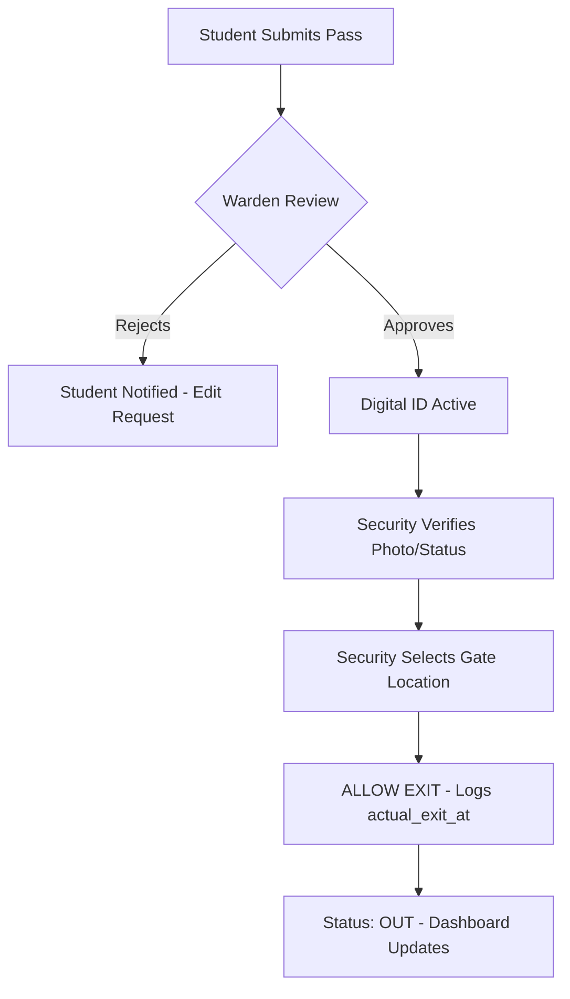
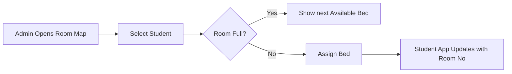

# 🏆 SMG CampusCore ERP: The Complete End-to-End Project Manual

This is the definitive guide to the SMG CampusCore Management System, covering every screen, feature, and data flow in the ecosystem.

---

## 🌟 1. SIVIO: The Core Vision

- **Service:** 100% paperless hostel management ecosystem.
- **Intelligence:** Real-time data synchronization using WebSockets and Redis.
- **Vision:** Enhancing student safety and administrative productivity through automation.
- **Integration:** A unified hub for Gate Security, Wardens, Kitchen, and Students.
- **Optimization:** High-speed React performance with sub-second API response times.

---

## 🗺️ 2. The Master Navigation Flow (Page-to-Page)

### 🔐 Part A: Identity & Access

| Starting Point    | Action                | Condition | Destination                        |
| :---------------- | :-------------------- | :-------- | :--------------------------------- |
| **Login Page**    | `Enter Credentials`   | Incorrect | **Login Page** (Error Toast)       |
| **Login Page**    | `Enter Credentials`   | Correct   | **Dashboard** (Role Specific Home) |
| **Login Page**    | `Click "New Account"` | -         | **Register Page**                  |
| **Register Page** | `Submit Form`         | Valid     | **Login Page**                     |
| **Login Page**    | `Forgot Password`     | -         | **Request Reset Page**             |
| **Dashboard**     | `Click "Logout"`      | -         | **Login Page**                     |

### 🎓 Part B: Student Core Lifecycle

| Starting Point     | Action                   | Result          | Destination                    |
| :----------------- | :----------------------- | :-------------- | :----------------------------- |
| **Dashboard**      | `View In-Hostel Status`  | Checks database | **Dashboard**                  |
| **Dashboard**      | `Click "My Gate Passes"` | Navigates       | **Gate Passes Page**           |
| **Gate Passes**    | `Click "(+) New Pass"`   | Opens Modal     | **Gate Pass Form**             |
| **Gate Pass Form** | `Record Audio + Submit`  | Creates record  | **Gate Passes Page** (Pending) |
| **Notifications**  | `Tap "Pass Approved"`    | Views Record    | **Digital ID** (Live QR Card)  |
| **Digital ID**     | `Scanned by Security`    | Updates DB      | **Dashboard** (Status: Out)    |
| **Dashboard**      | `View Dues`              | Sees Fines      | **Fines Page**                 |

### 🛡️ Part C: Warden & Admin Management

| Starting Point      | Action                     | Result            | Destination                   |
| :------------------ | :------------------------- | :---------------- | :---------------------------- |
| **Dashboard**       | `Approvals Needed`         | View Pending      | **Gate Passes Page**          |
| **Gate Passes**     | `Listen to Audio Brief`    | Verifies Student  | **Detail Dialog**             |
| **Detail Dialog**   | `Click "Approve"`          | Broadcasts to Std | **Gate Passes Page**          |
| **Side Nav**        | `Manage Blocks`            | View Occupancy    | **Rooms Page**                |
| **Rooms Page**      | `Click "Visual Map"`       | Drag-and-drop     | **Room Mapping**              |
| **Side Nav**        | `Mark Attendance`          | Grid view         | **Attendance Page**           |
| **Attendance Page** | `Identify 3-day Absentees` | View Defaulters   | **Fines Page** (Issue Action) |

---

## 🛠️ 3. Full Feature Inventory (Module by Module)

### 1. Gate Pass System

- **Features:** Multi-day/Day passes, Audio Brief verification, real-time approval push notifications, Digital ID generation, Gate location tracking (Main/Side/Back).
- **Flow:** Student Request ➔ Warden Approval ➔ Security Exit Scan ➔ Security Return Scan.

### 2. Digital Attendance & Scanning

- **Features:** QR-based verification, NFC/Manual override, Block-wise attendance grids, Defaulter tracking (automated identifying of long absences).
- **Flow:** Warden Check ➔ Real-time update to Parent/Admin dashboards.

### 3. Room & Facility Management

- **Features:** Bed-level allocation, Room swap logic, Floor-wise visual mapping, Maintenance logging via Complaints.
- **Flow:** Admin Allocates ➔ Room status updates ➔ Student notified of room number.

### 4. Smart Mess & Meals

- **Features:** Dynamic menu scheduling, Meal forecasting (predicting crowd size), Ingredient tracking, Student feedback loop.
- **Flow:** Chef updates menu ➔ Students see menu ➔ Entry marked at mess.

### 5. Disciplinary & Notices

- **Features:** Role-targeted announcements (Priority levels), Fine issuance, Fine payment tracking with receipts, Automated risk profiling.
- **Flow:** Warden issues fine ➔ Notification sent ➔ Admin marks as paid.

---

## 📊 4. End-to-End Business Flow Charts

### **The "Safe Exit" Logic**

### **The "Room Allocation" Logic**

---

## 💻 5. Under the Hood: Technical Stack

| Layer        | Technology             | Why?                                    |
| :----------- | :--------------------- | :-------------------------------------- |
| **Client**   | React 18 / TypeScript  | Type-safe, high-speed SPA.              |
| **Styles**   | Tailwind / shadcn/ui   | Premium, mobile-responsive visuals.     |
| **API**      | Django REST Framework  | Secure, robust, and scalable.           |
| **Sync**     | WebSockets + Redis     | Zero-refresh real-time updates.         |
| **Database** | PostgreSQL             | Reliability and complex data integrity. |
| **Audit**    | AuditLogger Middleware | Tracking every move for security.       |

---

## 🚢 6. Deployment Workflow

1.  **Code Check:** All PRs passed with logic validation.
2.  **Frontend Build:** `npm run build` ➔ `/dist` folder.
3.  **Backend Tasks:** `migrate` ➔ `collectstatic`.
4.  **Reverse Proxy:** **Nginx** handles SSL and routes `/api` and `/ws`.
5.  **Monitoring:** **Sentry** for errors & **UptimeRobot** for availability.

---

**Document Status:** Complete End-to-End Finalized ✅
**Author:** Antigravity AI
