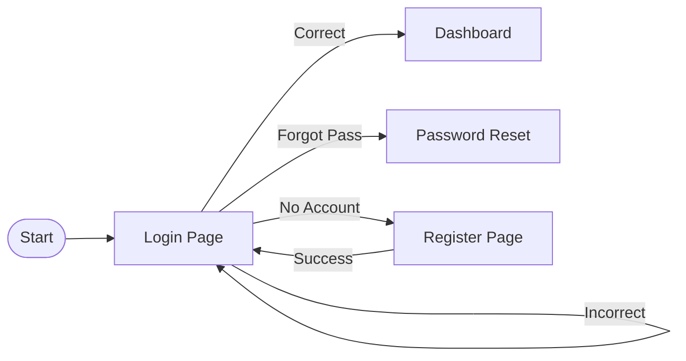
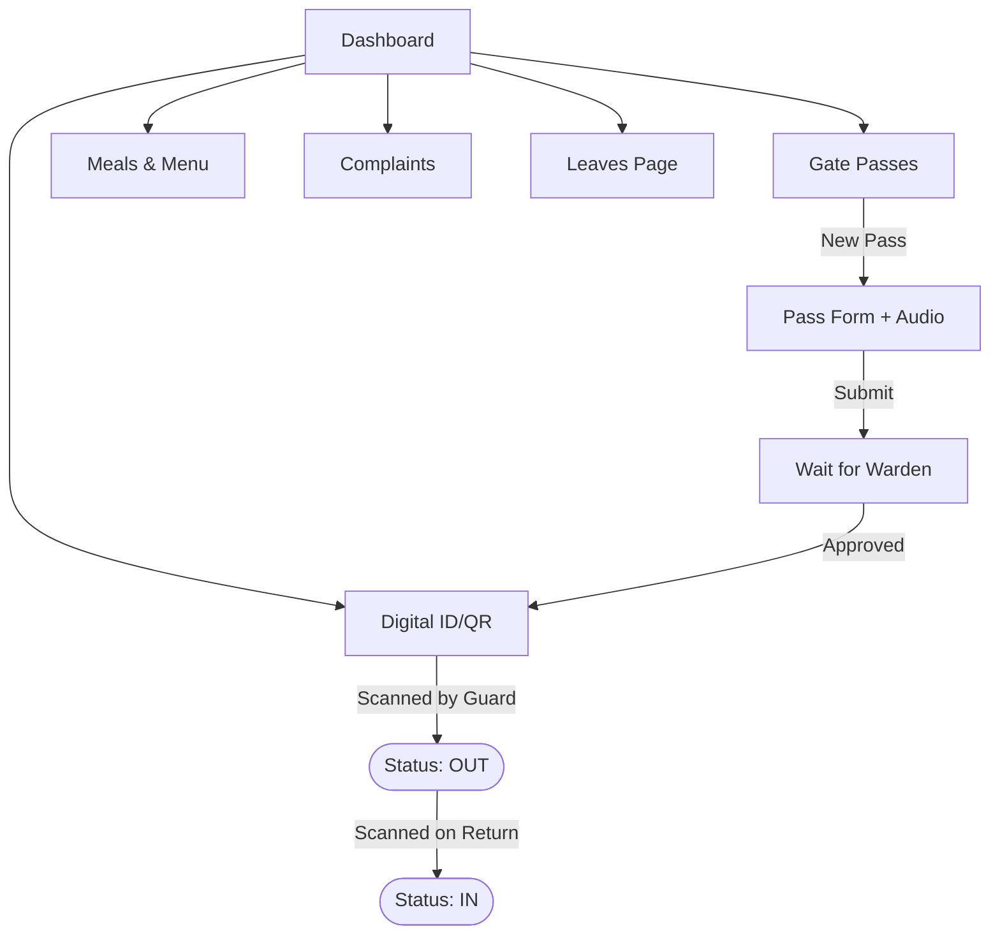
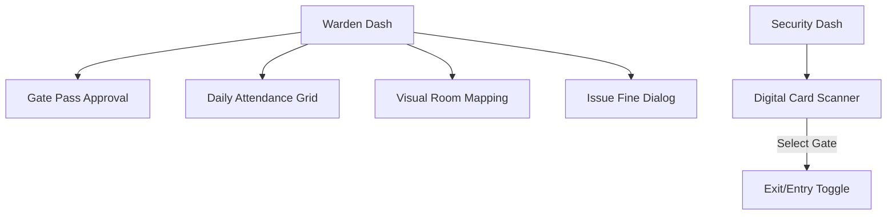

# SMG CampusCore ERP - Master Project Blueprint & SIVIO

This document represents the complete service architecture, visual screen flows, and technical vision for the SMG CampusCore ERP.

---

## 🌟 1. SIVIO (Service, Intelligence, Vision, Integration, Optimization)

- **S - Service:** A unified digital ecosystem for students, wardens, and security to manage daily hostel operations without a single piece of paper.
- **I - Intelligence:** Smart data invalidation using WebSockets ensuring that no user ever has to "Pull to Refresh". If it happens in the hostel, it happens on the screen instantly.
- **V - Vision:** To become the standard for modern educational housing, prioritizing student safety through traceable gate passes and audio-verified requests.
- **I - Integration:** Seamless connection between Dining (Meals), Security (Gate), and Admin (Fines/Rooms) where data from one module (e.g., Gate Scan) automatically updates another (e.g., Attendance Stats).
- **O - Optimization:** React code-splitting, lazy loading, and Redis-backed backend signals ensuring the app remains fast even with 10,000+ users.

---

## 🗺️ 2. Master Screen-to-Screen Flow (Visualized)

### A. Authentication & Onboarding

### B. The Student Journey

### C. The Warden & Security Workflow

---

## 📑 3. Complete Screen Directory (Role Based)

| Screen Name        | Accessible By             | Key Data Handled                       |
| :----------------- | :------------------------ | :------------------------------------- |
| **LoginPage**      | All                       | Auth Tokens, Sessions                  |
| **Dashboard**      | All                       | Real-time Stats, Summary Cards         |
| **GatePassesPage** | Student, Warden, Security | Pass Requests, Audio Briefs, Status    |
| **AttendancePage** | Warden, Student, Chef     | Daily Presence logs, Meal Counts       |
| **MealsPage**      | Chef, Student             | Menu schedule, Ingredients, Forecast   |
| **DigitalID**      | Student                   | Dynamic QR, Personal Data Verification |
| **RoomsPage**      | Admin, Warden             | Bed vacancy, Maintenance status        |
| **FinesPage**      | Warden, Student, Admin    | Disciplinary actions, Payment status   |
| **GateScansPage**  | Security, Admin           | Movement logs, Audit history           |
| **MetricsPage**    | Admin, Security Head      | Occupancy trends, Security performance |
| **ComplaintsPage** | All                       | Support tickets, Resolution tracking   |
| **RoomMapping**    | Admin, Warden             | Visual drag-and-drop floor plan        |
| **VisitorsPage**   | Security, Warden          | Guest registration, Log history        |
| **LeavesPage**     | Student, Warden           | Long-term absence approval             |

---

## 🛠️ 4. Technology Inventory ("What are used")

### **Frontend (Vite + React + TS)**

- **UI/UX:** `shadcn/ui` + `Lucide React` + `Tailwind CSS`.
- **Query Engine:** `@tanstack/react-query` (Syncing all UI data).
- **State:** `Zustand` (Fast global storage).
- **Haptics:** Native Vibration API for security confirmations.

### **Backend (Django + PostgreSQL + Redis)**

- **API:** Django REST Framework (DRF) with SimpleJWT.
- **Real-Time:** Django Channels with **Redis Channel Layer**.
- **Validation:** Custom logic for Gate Pass safety and Room capacity.
- **File Handling:** Audio briefs and Profile photos storage.

### **Deployment Pipeline**

1.  **Version Control:** Git/GitHub.
2.  **Environment:** `.env` controlled settings for Production vs Development.
3.  **App Hosting:** **Render/Railway** (or VPS).
4.  **Static Serving:** optimized via WhiteNoise and Gzip compression.

---

**SMG CampusCore ERP - Final Architectural Documentation**
