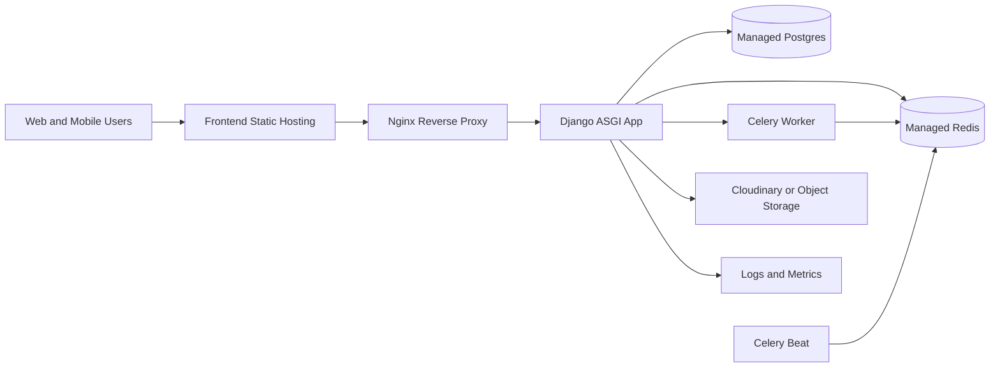

# Production Command Center

This is the execution blueprint to run the current product as a real SaaS for 3k users now and 10k next, with tight budget and controlled risk.

## 1) Target architecture

### Why this shape
- Keeps complexity low while supporting real multi-tenant traffic.
- Enables horizontal scale later without redesigning app code.
- Uses Redis once for cache + queue + websocket support.

## 2) Budget-first infra plan (target $20-30)

### Stage A (3k users, budget mode)
- 1 app host (2 vCPU / 2-4 GB RAM).
- 1 managed Postgres small tier.
- 1 managed Redis small tier.
- Frontend static host.

Estimated monthly range:
- App host: $12-18
- Postgres: $7-15
- Redis: $5-12
- Frontend static: $0-5

Total realistic range: $24-50 depending on provider and region.

If strict $20-30 is mandatory:
- Run Postgres + Redis on same Droplet initially (higher ops risk).
- Keep daily backups and strict alerts.

## 3) Deployment strategy

### Recommended for current codebase
- Frontend: static deploy (Vite output).
- Backend: DigitalOcean App Platform or Docker on Droplet.
- Use one domain split:
  - `app.yourdomain.com` -> frontend
  - `api.yourdomain.com` -> backend

### Environment essentials
- Backend: `SECRET_KEY`, `DEBUG=False`, `DATABASE_URL`, `REDIS_URL`, `ALLOWED_HOSTS`, `CSRF_TRUSTED_ORIGINS`, `FRONTEND_URL`.
- Frontend: `VITE_API_URL`, `VITE_WS_URL`.
- Strongly recommended backend extras:
  - `DATABASE_SSL_REQUIRE=True` (for managed Postgres providers like DigitalOcean)
  - `RUN_MIGRATIONS=0` on web instances if migrations run via release job

### CI/CD minimum
- On PR: lint + unit tests + `python manage.py check` + frontend build.
- On merge to main: deploy staging, smoke tests, then production.
- Keep rollback to previous image/build artifact.
- Keep migrations and tests **blocking** in CI (do not mark as non-blocking).

## 4) Super-admin critical flows (must pass before launch)

- Login as `super_admin` and land on `/colleges`.
- Switch college scope in Dashboard and see metric changes.
- Open `/tenants?college=<id>` and `/users` scoped views.
- College lifecycle:
  - create college
  - disable college (`toggle_active`)
  - re-enable college
- Role governance:
  - promote to admin (super-admin only)
  - verify admin cannot perform super-admin-only actions.

## 5) Performance SLOs and guardrails

### Initial SLOs
- Auth APIs p95 < 300 ms.
- Dashboard and scope-based metrics p95 < 600 ms.
- Users/tenants list p95 < 800 ms with pagination.
- Error rate < 1%.

### Guardrails
- Enable SQL slow query logs.
- Add endpoint timing middleware for top 10 APIs.
- Cache high-read aggregates with TTL (already implemented for super-admin dashboard/activity).
- Keep pagination mandatory on list endpoints.

## 6) Database and query tuning

### Must-have indexes
- `GatePass(status, created_at, college_id)`
- `Attendance(attendance_date, college_id, status)`
- `Notice(published_date, college_id)`
- `Complaint(status, college_id, updated_at)`
- `User(college_id, role, is_active)`

### Query discipline
- No unbounded cross-tenant scans for super-admin views.
- Always include scope in cache keys (`all` vs `college_id`).
- Use select_related/prefetch_related for list endpoints.

## 7) Security model

- Keep auth cookie + refresh flow hardened.
- Enforce RBAC in backend first, never UI-only.
- Validate super-admin actions server-side (already done for college writes).
- Ensure list/retrieve endpoints for control-plane entities are authenticated.
- Add rate limits for auth + expensive search/list endpoints.

## 8) Test plan

### Automated
- Unit tests: RBAC decisions, role hierarchy, scope resolution.
- API integration: super-admin scoped dashboard and activities with/without `college_id`.
- Regression: college disable/enable lockout behavior.

### Manual smoke (release gate)
- Super-admin scope switch reflects across:
  - dashboard cards
  - recent activity
  - tenants/users views
- Verify no data leakage when switching roles.
- Verify stale cache does not show wrong college after scope change.

## 9) 30-day roadmap (3k -> 10k)

### Week 1
- Freeze role matrix and super-admin flows.
- Run load baseline on dashboard/users/tenants endpoints.

### Week 2
- Add missing indexes from real slow-query logs.
- Add API-level p95 monitoring and alerting.

### Week 3
- Add pre-aggregates for heavy analytics (`DailyHostelMetrics` expansion).
- Tune celery queues and retry policies.

### Week 4
- Run 2x expected load test.
- Finalize failover and rollback drills.

## 10) Go-live checklist (single page)

- [ ] All env vars set in production and verified.
- [ ] DB migrations clean.
- [ ] Redis connected and cache hit ratio acceptable.
- [ ] Worker + beat running.
- [ ] Super-admin smoke suite passed.
- [ ] Observability dashboards live.
- [ ] Rollback command tested once.

## Related docs
- [SUPER_ADMIN_LAUNCH_READINESS.md](SUPER_ADMIN_LAUNCH_READINESS.md)
- [SUPER_ADMIN_CAPABILITY_MATRIX.md](SUPER_ADMIN_CAPABILITY_MATRIX.md)
- [ROLE_GOVERNANCE.md](ROLE_GOVERNANCE.md)
